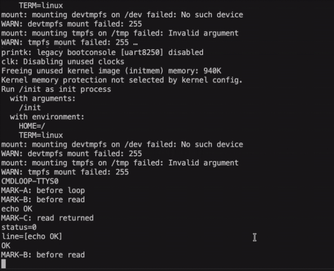
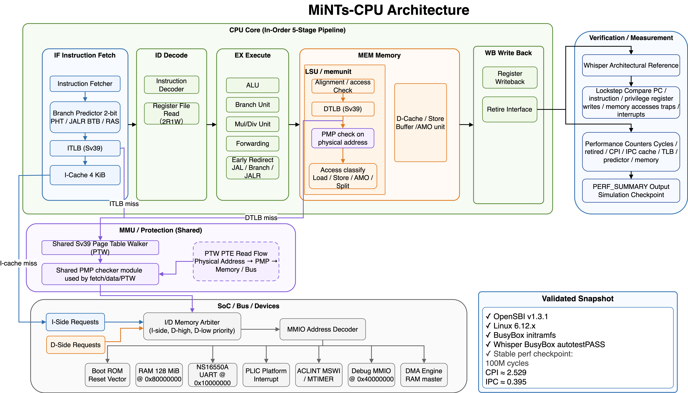

# MiNTs-CPU

Last updated: 2026-08-14

**MiNTs-CPU** is a SystemVerilog RV64IMAC in-order RISC-V CPU/SoC capable of
booting OpenSBI, Linux 6.12, and a BusyBox initramfs in Verilator.

The project started from the `cpu.kanataso.net` teaching CPU material, but the
current tree has moved well beyond bring-up: it now uses Tenstorrent Whisper
lockstep validation and performance counters to guide microarchitectural
optimization.

- Reference: https://cpu.kanataso.net/
- Current status: [Docs/CURRENT_STATUS.md](Docs/CURRENT_STATUS.md)
- Linux setup: [Docs/LINUX_SETUP.md](Docs/LINUX_SETUP.md)
- Linux baseline: [Docs/LINUX_BASELINE.md](Docs/LINUX_BASELINE.md)
- Test status: [Docs/TEST_STATUS.md](Docs/TEST_STATUS.md)
- Performance counters: [Docs/PERFORMANCE_COUNTERS.md](Docs/PERFORMANCE_COUNTERS.md)
- Roadmap: [Docs/ROADMAP.md](Docs/ROADMAP.md)
- RTL layout: [Docs/RTL_LAYOUT.md](Docs/RTL_LAYOUT.md)
- Third-party notices: [NOTICE](NOTICE)

## Highlights

- RV64IMAC in-order core with M/S/U privilege support
- Sv39 MMU with shared PTW, ITLB, and DTLB
- PMP checks on fetch, data, and PTW physical accesses
- ACLINT MSWI/MTIMER, PLIC-compatible interrupt controller, and NS16550A UART
- 4KiB I-cache, stable 16KiB D-cache, and 8-entry store buffer
- Forwarding, early JAL/branch/JALR redirect, 2-bit PHT, JALR BTB, and RAS
- OpenSBI -> Linux 6.12 -> BusyBox userspace boot path
- Whisper lockstep verification through BusyBox autotest
- Performance tuning from a 300M-cycle CPI 6.918 baseline to a stable
  100M-cycle CPI 2.529 checkpoint

## Current Snapshot



The current validated target is:

```text
MiNTs-CPU
  -> OpenSBI v1.3.1 fw_jump
  -> Linux 6.12.x
  -> rv64imac/lp64 static BusyBox initramfs
  -> /init autotest
  -> BUSYBOX-TEST-PASS
```

The Whisper lockstep harness has also reached the BusyBox autotest pass point:

```text
[LOCKSTEP] BusyBox autotest pass detected compared_order=61610274
[LOCKSTEP] PASS: 61610275 instructions compared (BusyBox autotest passed)
```

That is the current strongest end-to-end correctness checkpoint.

## Architecture



## CPU / SoC Features

Current claimed scope:

| Area | Status |
|---|---|
| ISA | RV64IMAC |
| Privilege | M/S/U mode, trap delegation, `mret`, `sret` |
| MMU | Sv39, shared PTW, ITLB, DTLB |
| Protection | 8-entry PMP, fetch/data/PTW physical checks |
| Interrupts | ACLINT MSWI/MTIMER, PLIC external interrupts |
| UART | Minimal NS16550A-compatible UART at `0x10000000` |
| Caches | 4KiB I-cache, stable 16KiB D-cache, 32B lines |
| Store path | write-through D-cache, 8-entry store buffer |
| Branch prediction | 2-bit PHT, JALR BTB, non-speculative RAS |
| Verification | riscv-tests, custom C tests, Linux boot, Whisper lockstep |

Not claimed:

```text
F/D floating point
Zb* bitmanip
SMP/cache coherence
write-back D-cache as stable baseline
full RVA23 compliance
FPGA timing closure
```

## Repository Layout

```text
src/
  core.sv                 CPU pipeline integration
  inst_fetcher.sv         frontend, ITLB, I-cache path
  memunit.sv              LSU, DTLB, D-cache path
  sv39_ptw.sv             Sv39 page table walker
  tlb.sv                  small associative TLB
  icache.sv               4KiB instruction cache
  dcache.sv               configurable data cache and store buffer
  csrunit.sv              privileged CSRs and trap handling
  pmp_checker.sv          PMP checker
  uart_ns16550.sv         minimal 16550-compatible UART
  plic.sv                 minimal PLIC
  aclint.sv               MSWI/MTIMER
  top.sv                  SoC top

platform/
  riscv_cpu.dts           Linux/OpenSBI device tree
  bootrom_linux.S         OpenSBI/Linux boot trampoline

tools/
  build-*.sh              OpenSBI/Linux/BusyBox helper scripts
  whisper_lockstep/       Whisper reference integration

tb/
  tb_verilator.cpp        Verilator harness
  unit/                   unit-level testbenches

third_party/patches/
  *.patch                 small reproducibility patches for external tools

Docs/
  *.md                    public project documentation
```

## Build And Run

Normal simulator:

```bash
make build
```

Interactive-input simulator:

```bash
make build-input \
  DCACHE_LINE_COUNT=512 \
  DCACHE_STORE_BUFFER_DEPTH=8 \
  DCACHE_WRITE_BACK=0
```

Run the current Linux BusyBox autotest image:

```bash
make run-opensbi-input \
  DCACHE_LINE_COUNT=512 \
  DCACHE_STORE_BUFFER_DEPTH=8 \
  DCACHE_WRITE_BACK=0 \
  OPENSBI_BIN=build/external/opensbi/build/platform/generic/firmware/fw_jump.bin \
  LINUX_IMAGE_BIN=build/external/linux-out/Image-linux-6.12-riscv64-busybox-autotest-initramfs \
  OPENSBI_CYCLES=0
```

Performance summary for a bounded run:

```bash
make run-opensbi-input \
  DCACHE_LINE_COUNT=512 \
  DCACHE_STORE_BUFFER_DEPTH=8 \
  DCACHE_WRITE_BACK=0 \
  OPENSBI_BIN=build/external/opensbi/build/platform/generic/firmware/fw_jump.bin \
  LINUX_IMAGE_BIN=build/external/linux-out/Image-linux-6.12-riscv64-busybox-cmdloop-ttyS0-irqcause-min-initramfs \
  OPENSBI_CYCLES=100000000 \
  SIM_EXTRA_ARGS=+PERF_SUMMARY \
  2>&1 | tee /tmp/perf-100m.log
```

The current stable performance baseline uses:

```text
DCACHE_LINE_COUNT=512
DCACHE_STORE_BUFFER_DEPTH=8
DCACHE_WRITE_BACK=0
```

Representative 100M-cycle result:

```text
[PERF] cycles=100000000 retired=39534138 cpi_x1000=2529 ipc_x1000=395
```

This number is a simulation checkpoint for comparing microarchitectural
changes, not a silicon or FPGA frequency result.

Whisper lockstep BusyBox autotest:

```bash
cd "$HOME/risc-v-cpu"

DOCKER_HOST=unix://$HOME/.colima/riscv-build/docker.sock \
docker run --rm \
  -v "$PWD:/work" \
  -w /work \
  riscv-lockstep-verilator:5.046 \
  bash -lc '
    rm -rf obj_dir_lockstep &&
    make build-lockstep \
      DCACHE_LINE_COUNT=512 \
      DCACHE_STORE_BUFFER_DEPTH=8 \
      DCACHE_WRITE_BACK=0 &&
    make run-opensbi-lockstep \
      DCACHE_LINE_COUNT=512 \
      DCACHE_STORE_BUFFER_DEPTH=8 \
      DCACHE_WRITE_BACK=0 \
      OPENSBI_BIN=build/external/opensbi/build/platform/generic/firmware/fw_jump.bin \
      OPENSBI_ELF=build/external/opensbi/build/platform/generic/firmware/fw_jump.elf \
      LINUX_IMAGE_BIN=build/external/linux-out/Image-linux-6.12-riscv64-busybox-autotest-initramfs \
      OPENSBI_CYCLES=0
  ' 2>&1 | tee /tmp/lockstep-autotest.log
```

## Test Commands

Core riscv-tests:

```bash
make test-riscv-all TEST_TIMEOUT=20 TEST_OUT=results-full
```

## Third-party Tools

This project optionally uses
[Tenstorrent Whisper](https://github.com/tenstorrent/whisper) as a RISC-V
instruction set simulator and architectural reference model for lockstep
verification. Whisper is licensed under the Apache License, Version 2.0.

The local `whisper/` checkout keeps Whisper's own `LICENSE` and
`Third-Party_Notices.txt`. See [NOTICE](NOTICE) for the project-level
third-party attribution note.

The `whisper/` checkout itself is intentionally not tracked in this
repository. For lockstep reproduction, apply the MiNTs-CPU compatibility patch
after cloning Whisper:

```bash
git clone https://github.com/tenstorrent/whisper.git whisper
git -C whisper checkout cc36ae56b31897d20ba115ba7c086ae35664d8b4
git -C whisper apply ../third_party/patches/whisper-mints-lockstep.patch
```

Useful custom tests:

```bash
make test-output
make test-uart
make test-uart-input INPUT_TEXT=Z
make test-uart-tx-seip
make test-uart-rx-seip INPUT_TEXT=Z
make test-mswi
make test-mtime
make test-os2-min
make test-os2-min-sv39
```

See [Docs/TEST_STATUS.md](Docs/TEST_STATUS.md) for the current verified scope.
